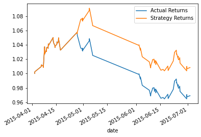
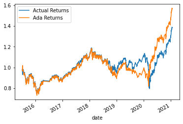

# Algorithmic Trading Bot
Algorithmic trading strategy that uses machine learning to automate the trade decisions

---

## Summary

This project is trading strategy to make trading decisions, made with Jupyter Notebook and that contains:
* An algorithmic trading strategy that uses machine learning to automate the trade decisions.
* Adjust the input parameters to optimize the trading algorithm.
* A second machine learning model with adjusted input parameters.
* An analysis to compare the performance of both models. 

---
## Installation and Usage

```sh
git clone https://github.com/diegoalcocer/algorithmic-trading-bot.git
cd algorithmic-trading-bot/
```
To start the Jupyther Notebook you could launch jupyter lab:

```sh
jupyter lab
```


### 📚 resources/

This project uses the following resources required for analysis 

* emerging_markets_ohlcv.csv:
  * 1/21/15 9:30 to 1/22/21 15:45
  * Contains the OHLCV dataset
* output1.png
  * Plot: SVM classifier returns vs actual returns 
* output2.png
  * Plot: AdaBoost classifier returns vs actual returns 

## Summary Evaluation

The following is a comparison of performance between the two models created in this project.
The models use the following:
1. `SVC` classifier from SKLearn's support vector machine (SVM) learning method to fit the training data and make predictions based on the testing data
2. `AdaBoost` classifier from SKLearn's ensemble to fit the data and make predictions

### Model 1: SVC

The first model has the following performance statistics:
  
            precision        recall       f1-score   support

      -1.0        1.00        0.06        0.12        49
       1.0        0.63        1.00        0.77        79

      accuracy                            0.64       128
      macro avg       0.82      0.53      0.44       128
      weighted avg    0.77      0.64      0.52       128

As a result of a high accuracy score, the model was able to predict and generate higher returns than the actual returns: 



### Model 2: AdaBoost

The second model has the following performance statistics:

                  precision    recall     f1-score   support

        -1.0       0.44       0.08        0.13      1804
         1.0       0.56       0.92        0.70      2288

      accuracy                            0.55      4092
      macro avg       0.50      0.50      0.41      4092
      weighted avg    0.51      0.55      0.45      4092

The AdaBoost classifier model had a low accuracy score and for that reason, the AdaBoost returns were in some cases lower than the actual returns



In **conclusion** the `SVC` model performs better than the `AdaBoost` model since it has a higher accuracy score 
* SVC accuracy score:         0.64
* AdaBoost accuracy score:    0.55
---

## License

[](https://www.gnu.org/licenses/gpl-3.0)
